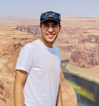

# Hello from Nashville 👋

My name is Zane. I'm a full stack software engineer based in Nashville, TN. I'm passionate about creating technology solutions that drive business success. I get excited about system architecture, leaning into best practices and language paradigms, and finding ways to empower and encourage growth in those around me.

**Tech**: Ruby, Ruby on Rails, Rspec, Javascript, React, Jest, HTML/CSS, AWS

**Tech I'm interested in**: Java, Spring, Python, Kafka

**Skills**: Domain Driven Design, Test Driven Development, Refactoring, Object Oriented Programming, Design Patterns, System Architecture

[View my resume](./assets/images/resume.pdf){:target="_blank"}

___

## About me

_(At Horseshoe Bend in Arizona)_

I graduated from [Nashville Software School](https://nashvillesoftwareschool.com/) in 2020 and have been working professionally building web applications and services in Ruby, Ruby on Rails, Java, and Spring.

Outside of software I enjoy being outdoors hiking and backpacking, traveling, and drinking coffee and talking about why everyone should try the [AeroPress Go](https://aeropress.com/products/aeropress-go-travel-coffee-press) (my favorite coffee device).
